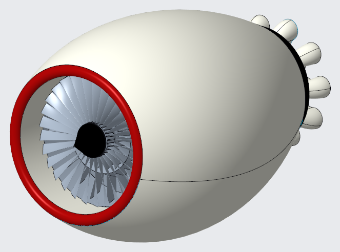
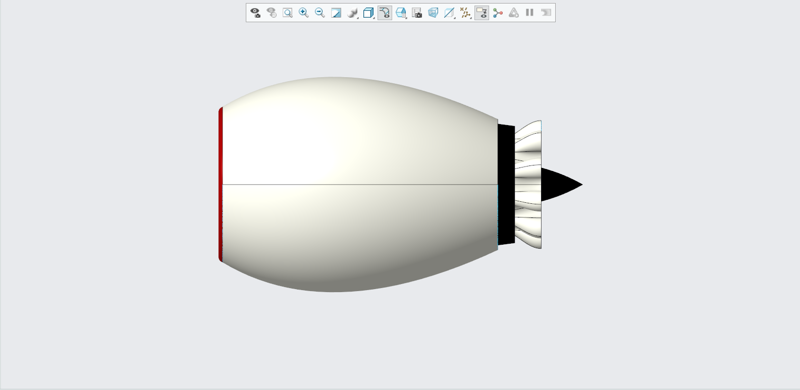
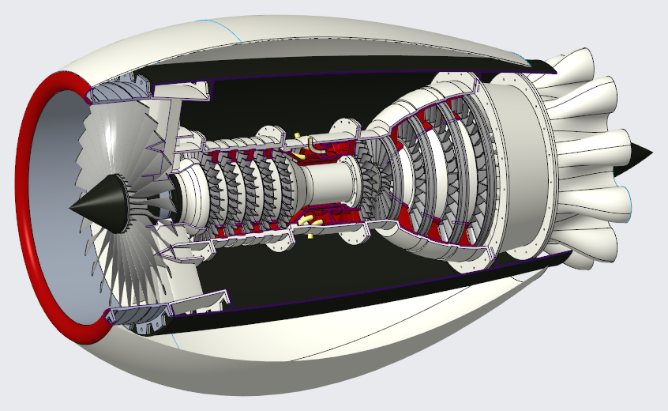
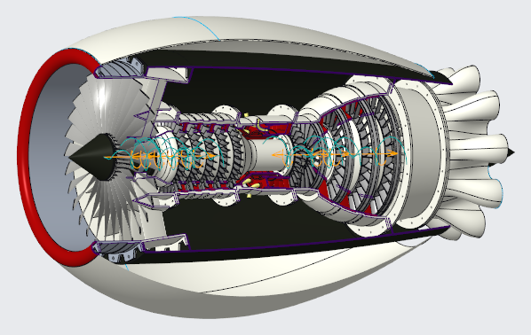
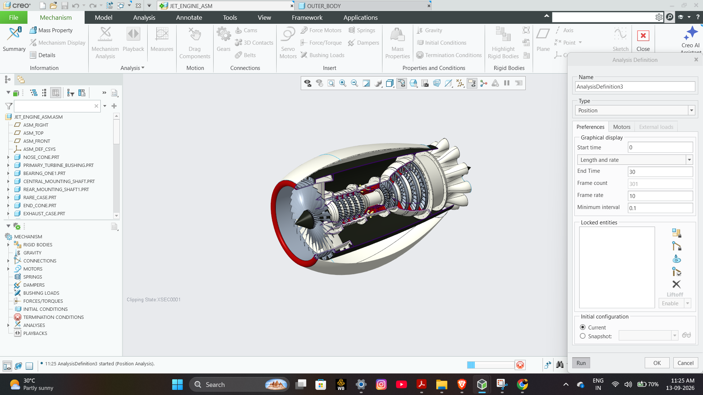

# Jet Engine Assembly

## Project Overview

A complete 3D CAD assembly of a jet engine developed to demonstrate complex mechanical assembly, component integration, assembly constraints, and design visualization.

### Software

- Creo Parametric

### Project Focus

- 3D CAD Modeling
- Mechanical Assembly
- Component Integration
- Assembly Constraints
- Mechanism & Motion Analysis
- Mechanical Design Visualization

---

## Project Highlights

- Complete jet engine assembly modeled in Creo Parametric
- Multiple mechanical components integrated into a single assembly
- Detailed internal compressor and turbine components
- Assembly constraints and component positioning
- Mechanism/motion analysis performed in Creo
- Cutaway visualization to show internal components

---

## Project Images

### Complete Assembly

### Side View

### Internal Cutaway View

### Motion Analysis

### Creo Mechanism Analysis

---

## Motion Analysis

The jet engine assembly was evaluated using Creo Parametric Mechanism/Motion Analysis to demonstrate assembly movement and mechanical system behavior.

**Software:** Creo Parametric  
**Analysis Type:** Position / Mechanism Analysis

### Motion Video

▶️ **[Watch Jet Engine Motion Analysis](jet-engine-motion-analysis.mp4.mp4)**

The video demonstrates the motion behavior of the assembled components in the Creo Parametric environment.
---

## Skills Demonstrated

- Part Modeling
- 3D CAD Modeling
- Mechanical Assembly
- Assembly Constraints
- Component Integration
- Mechanism Design
- Motion Analysis
- Design Visualization
- CAD Assembly Documentation

---

## Project Outcome

This project helped develop practical skills in complex mechanical assembly, component integration, CAD visualization, and mechanism-based motion analysis using Creo Parametric.
